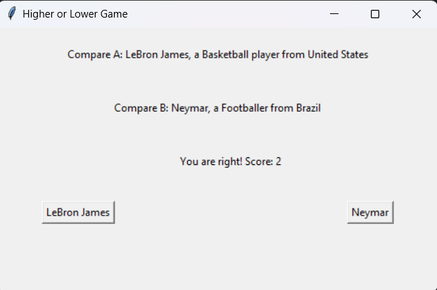

# Higher or Lower Game

A simple graphical game built with Python's Tkinter where players guess which celebrity has a higher number of Instagram followers. The game displays two celebrities at a time, and the player has to choose which one they believe has more followers.

## Table of Contents

- [Features](#features)
- [Requirements](#requirements)
- [Installation](#installation)
- [How to Play](#how-to-play)
- [Project Structure](#project-structure)
- [License](#license)

## Features

- Compare two random celebrities and guess who has more Instagram followers.
- Simple and intuitive graphical interface built with Tkinter.
- Displays the name, profession, and country of each celebrity.
- Keeps track of the player's score.

## Requirements

- Python 3.x
- Tkinter (comes pre-installed with Python)

## Installation

1. **Clone the repository**:
    ```sh
    git clone https://github.com/your-username/higher-or-lower-game.git
    cd higher-or-lower-game
    ```

2. **Run the game**:
    ```sh
    python main.py
    ```

## How to Play

1. When the game starts, you will see two celebrities displayed on the screen.
2. Each celebrity will have their name, a brief description, and their country displayed.
3. You need to guess which of the two celebrities has more Instagram followers by clicking the button with their name.
4. If you guess correctly, your score increases, and the game continues with the next comparison.
5. If you guess incorrectly, the game ends, and your final score is displayed.

## Project Structure


### game_data.py

Contains a list of dictionaries, where each dictionary represents a celebrity. The fields include:
- `name`: Name of the celebrity
- `follower_count`: Number of Instagram followers
- `description`: A brief description of the celebrity
- `country`: The country the celebrity is from

### main.py

The main script that runs the game. It handles:
- Randomly selecting celebrities from `game_data.py`.
- Displaying the information to the user using Tkinter.
- Managing the game logic, such as comparing follower counts and tracking the player's score.

## Screenshots



## License

This project is open-source and available under the [MIT License](LICENSE).
